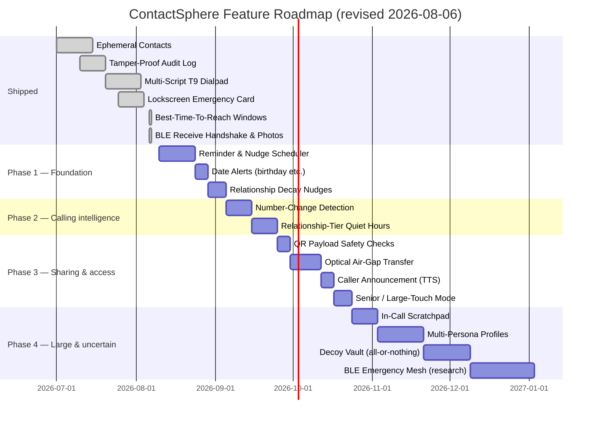

# ContactSphere — Feature Analysis & Innovation Roadmap

**Last re-verified against code:** 2026-08-06 (BLE handshake + photos verified same day)

## How to read this document

- This document holds **proposals and status**, not proof of what ships. For what the app
  actually does today, read [docs/features.md](file:///l:/Android/SreerajPContactSphere/docs/features.md) —
  that file is the ground truth.
- Every "Shipped" claim below was checked against the code in `lib/` and
  `android/app/src/main/kotlin/` on the date above. Every "Not started" claim means I searched
  the codebase and found no service, no screen, no permission, and no native class for it.
  Both directions are re-checked on each pass — a "Not started" line is re-searched, not
  carried over on trust.
- If the code has changed since that date, trust the code over this file.

---

## 1. Ecosystem context — the other 18 apps

ContactSphere is one app in a family of 18 offline-first, privacy-first Android apps (see
`L:\Android\MyFlutterApps\myapps.md`). This matters for the roadmap in two ways: some hard parts
are already solved next door, and some ideas should be refused here because a sibling app owns
them properly.

### 1.1 Proven parts to reuse, not reinvent

| Need in ContactSphere | Already solved in | What to copy |
| :--- | :--- | :--- |
| Scheduled notifications that survive reboot | **SMS Sentry** (`ReminderAlarmScheduler`, `ScheduledSmsScheduler`, `BootReceiver`), **ChronoTune** | Exact `AlarmManager` alarms + a boot receiver that re-arms them. ContactSphere is half way there already: it has `EmergencyBootReceiver` and a native Smart Redial alarm. |
| Camera-only device-to-device transfer | **SreerajP Authenticator**, **Sreeraj P QR Reader** | Multi-frame "optical air-gap" QR streaming, no network and no Bluetooth. |
| Checking a scanned QR before trusting it | **Sreeraj P QR Reader** | Layered link/tamper checks on a scanned payload. |
| Repeating date rules (birthdays, follow-ups) | **SreerajP ToDo** | RFC 5545 RRULE recurrence with human-readable descriptions. |
| Offline Malayalam voice/text parsing | **ChronoTune** | On-device `ml-IN` parsing of numerals and relative expressions, no cloud. |
| Encrypted P2P LAN sync with QR pairing | **SMS Sentry**, **TextData**, **Authenticator** | ContactSphere already has its own version; the sibling versions are useful reference for hardening (PBKDF2 iteration counts, unambiguous pairing alphabet). |

### 1.2 Do not build these here

Each of these is a whole app next door. ContactSphere should hand off through the Android share
sheet or an intent instead of growing a second-rate copy.

- SMS inbox, OTP extraction, transaction parsing → **SMS Sentry**
- Notes, diaries, rich text, voice recordings → **SreerajP Journal Vault**
- Task lists and time tracking → **SreerajP ToDo**
- Two-factor codes → **SreerajP Authenticator**
- Hiding files / storage analytics → **Vault Files**
- Making or reading PDFs → **SreerajP PDF App**

This directly bounds two ideas below: the in-call scratchpad stays a short call-scoped note, not
a notebook; and post-call follow-ups stay contact-scoped reminders, not a task manager.

---

## 2. Current foundation

- **Encrypted database at rest** — SQLCipher via
  [`sqflite_sqlcipher`](file:///l:/Android/SreerajPContactSphere/pubspec.yaml), key held in the
  Android Keystore via `flutter_secure_storage`.
- **Offline peer-to-peer sharing** — BLE transfer
  ([`ble_share_service.dart`](file:///l:/Android/SreerajPContactSphere/lib/services/ble_share_service.dart)),
  QR exchange ([`qr_share_service.dart`](file:///l:/Android/SreerajPContactSphere/lib/services/qr_share_service.dart)),
  encrypted LAN sync ([`p2p_sync_service.dart`](file:///l:/Android/SreerajPContactSphere/lib/services/p2p_sync_service.dart)),
  and vCard/CSV import & export.
- **Native telecom and calling** — default-dialer role, own in-call UI with call waiting, hold,
  swap and merge ([`in_call_screen.dart`](file:///l:/Android/SreerajPContactSphere/lib/screens/in_call_screen.dart),
  [`telecom_service.dart`](file:///l:/Android/SreerajPContactSphere/lib/services/telecom_service.dart)),
  and pre-ring call screening in Kotlin that works with the app closed.
- **Smart Redial** — after a chosen delay the app **places the call itself**, scheduled and fired
  natively ([`SmartRedialManager.kt`](file:///l:/Android/SreerajPContactSphere/android/app/src/main/kotlin/in/sreerajp/contact_sphere/SmartRedialManager.kt),
  [`SmartRedialReceiver.kt`](file:///l:/Android/SreerajPContactSphere/android/app/src/main/kotlin/in/sreerajp/contact_sphere/SmartRedialReceiver.kt),
  [`smart_redial_service.dart`](file:///l:/Android/SreerajPContactSphere/lib/services/smart_redial_service.dart)).
  The alarm fires a broadcast receiver that dials through Telecom directly (SIM chosen at
  schedule time), so no activity or Flutter engine has to start first.
  It survives app death and reboot, and cancels itself the moment the number calls back.
  *(An earlier version of this document called it a reminder notification. That is out of date.)*
- **Contextual intelligence** — pre-call summary
  ([`pre_call_summary_service.dart`](file:///l:/Android/SreerajPContactSphere/lib/services/pre_call_summary_service.dart)),
  caller context headlines
  ([`caller_context_service.dart`](file:///l:/Android/SreerajPContactSphere/lib/services/caller_context_service.dart)),
  relationship scoring
  ([`relationship_scoring_service.dart`](file:///l:/Android/SreerajPContactSphere/lib/services/relationship_scoring_service.dart)),
  and best-time-to-reach windows
  ([`reach_window_service.dart`](file:///l:/Android/SreerajPContactSphere/lib/services/reach_window_service.dart)) —
  all of which only inform the user; none of them place a call.
- **Security** — app lock (biometric or app PIN with recovery code)
  ([`app_lock_screen.dart`](file:///l:/Android/SreerajPContactSphere/lib/screens/app_lock_screen.dart)),
  `FLAG_SECURE` screen protection, secret contacts, and a hash-chained audit log
  ([`audit_log_screen.dart`](file:///l:/Android/SreerajPContactSphere/lib/screens/audit_log_screen.dart)).
- **Localization** — Malayalam and Latin script throughout, plus Devanagari, Cyrillic, Arabic and
  Greek T9 keypad mappings, with three bundled SIL OFL fonts.

---

## 3. Status of the seven original concepts

### ⏱️ 1. Ephemeral / self-destructing contacts — **Shipped**

Implemented in
[`ephemeral_contact_service.dart`](file:///l:/Android/SreerajPContactSphere/lib/services/ephemeral_contact_service.dart),
with controls on the add/edit and detail screens.

Expiry of 2 hours, 24 hours or 7 days, or "delete after 1 call". Stored only in the local
encrypted database, never pushed to Android system contacts. Scrubbing also deletes the matching
Recents rows. The detail screen offers "+24 Hours", "Keep Permanently" and "Scrub Now".

---

### ⌨️ 2. Multi-script T9 dialpad — **Shipped, and wider than planned**

Implemented in [`t9_utils.dart`](file:///l:/Android/SreerajPContactSphere/lib/utils/t9_utils.dart),
[`malayalam_transliterator.dart`](file:///l:/Android/SreerajPContactSphere/lib/utils/malayalam_transliterator.dart)
and [`dialer_screen.dart`](file:///l:/Android/SreerajPContactSphere/lib/screens/dialer_screen.dart).

The original idea was Malayalam + English. What shipped also covers Devanagari, Cyrillic, Arabic
and Greek, plus a locale auto-detect mode and a Latin-only mode, all selectable in Settings.

---

### 💖 3. Relationship decay engine & wellbeing nudge — **Not started (scoring only)**

The **scoring** half exists: `relationship_scoring_service.dart` computes a weighted score from
call frequency, recency and post-call sentiment, and writes it to `contacts.relationship_score`.
The **nudge** half does not exist — no decay curve, no threshold, and nothing that raises a
notification.

**Blocked by:** the missing notification scheduler (section 4).

---

### 🎭 4. Dynamic multi-persona calling profiles — **Not started**

No persona model, no persona table, no switcher in
[`home_shell.dart`](file:///l:/Android/SreerajPContactSphere/lib/screens/home_shell.dart).

**Blocked by:** the notification scheduler for per-persona reminders, and by a design decision
that has not been made — whether a persona filters what you *see* (a view over tags) or changes
what the app *does* (default SIM, quick replies, screening rules). The second is far larger.

---

### 🔒 5. Decoy vault / stealth lock mode — **Not started**

`app_pin_service.dart` stores one salted PIN hash and one recovery code hash. There is no second
PIN, no decoy dataset, and no scrubbed environment.

**Note on honesty:** a decoy vault is only meaningful if the decoy environment is
indistinguishable from the real one — matching call history, matching audit log, matching
Recents. A half-built version that shows an obviously-empty app is worse than none, because it
tells a coercing party that a real vault exists. This should be built completely or not at all.

---

### 🎙️ 6. In-call scratchpad & floating note HUD — **Not started**

No overlay widget, no scratchpad, and `SYSTEM_ALERT_WINDOW` is not requested in the manifest.

**Scope guard:** per section 1.2, this stays a short note attached to one call, feeding
`caller_context_service.dart`. Anything longer belongs in Journal Vault, reached through the
share sheet.

---

### 🛡️ 7. Offline BLE emergency mesh broadcast — **Not started**

The BLE stack exists as a one-to-one GATT server/client for contact transfer. There is no
broadcast mode, no relay/hop logic, no de-duplication of a re-broadcast packet, and no
Wi-Fi Direct.

**Honest assessment:** this is the largest and least certain item in the whole document. A
multi-hop mesh on Android BLE has real constraints — background advertising limits, per-OEM
scan throttling, no guarantee any other device nearby has the app installed — and there is no
way to test it properly without several physical devices. It stays on the roadmap as a research
item, deliberately last.

---

## 4. The missing foundation — a notification scheduler

Three separate things wait on one absent piece:

1. **Relationship-decay nudges** (section 3.3).
2. **Per-persona reminders** (section 3.4).
3. **The reminder rows the app already writes today.** Post-call follow-ups create rows through
   `reminder_repository.dart`, and nothing ever fires them. This is recorded as a known gap in
   [docs/features.md](file:///l:/Android/SreerajPContactSphere/docs/features.md).

Every notification the app shows today — missed call, in-call, emergency card — is built
directly in Kotlin with `NotificationCompat`. There is no Flutter-side scheduling library wired
in, and no generic "wake up later and notify" path.

**Recommended approach:** copy the pattern SMS Sentry and ChronoTune already use — exact
`AlarmManager` alarms plus a boot receiver that re-arms everything after a restart — rather than
adding a scheduling package. ContactSphere already has both halves of that pattern in the
codebase for other purposes (`EmergencyBootReceiver`, and the native Smart Redial alarm), so this
is generalising existing native code, not new ground.

This is the first item on the revised roadmap because it unblocks the most work per unit of
effort.

---

## 5. New proposed features

All of these were proposals when this section was written; they ship one at a time, so each
carries its own status heading. Anything without a "Shipped" marker does not exist yet. Each
notes why it belongs in a *contacts and dialer* app specifically, so it does not drift into a
sibling app's territory.

### 5.1 Unified reminder & nudge scheduler — **size L, no dependencies**

The foundation from section 4, exposed as one service that any feature can schedule against.
First consumers: the stranded reminder rows, relationship-decay nudges, and birthday /
anniversary / meetiversary alerts (the app already stores all three dates and never alerts on
any of them).

*Why here:* the contact record is where these dates live. *No overlap:* recurring **tasks** stay
in SreerajP ToDo; this only fires alerts tied to a contact.

### 5.2 Best-time-to-reach windows — **Shipped**

Implemented in
[`reach_window_service.dart`](file:///l:/Android/SreerajPContactSphere/lib/services/reach_window_service.dart),
with the day-part model in
[`reach_window.dart`](file:///l:/Android/SreerajPContactSphere/lib/models/reach_window.dart).

Computes, per contact, when calls to them actually connect — from the app's own Recents data
(answered vs. missed, by part of the day and weekday/weekend, over the last 180 days). Shown as
a line on the pre-call summary ("Usually answers after 5pm") and, as an opt-in dialer source,
used to order the top-contacts strip ("Likely to answer now").

It stays silent unless the history supports the claim: 8+ calls, 3+ in the winning day part, and
that part at least 20 points above the contact's own average. Below that it says nothing, which
is better than a confident wrong guess.

**Still outstanding:** the "nudge now" case, which needs 5.1. That is the only part of this item
not built.

**Advice only — it must never dial.** This feature may show a line and change the order of a
list. It may not place a call, schedule one, or start a redial. Every call it leads to is a tap
the user makes. Auto-dialing stays confined to Smart Redial, where the user sets the delay
themselves; that scheduler is untouched by this item.

*Why here:* this is the honest, data-backed replacement for the old "rank business contacts
during office hours" idea, which guessed. The app already has the data. *No overlap:* nothing.

### 5.3 Number-change detection — **size M**

When an unknown number starts behaving like a known contact — the same display name appears in
system contacts, or two-way calls begin right after an old number goes silent — offer a one-tap
"Is this <name>'s new number?" to attach it to the existing contact.

*Why here:* changing numbers is common, and today it silently creates an orphan. The duplicate
engine already has the number-matching and merge machinery to build on. *No overlap:* nothing.

### 5.4 Relationship-tier quiet hours — **size M**

Night-time silencing where only chosen tiers ring through — immediate family and emergency
contacts, say — and everyone else is silenced but still logged. Enforced by the existing native
call-screening service, so it works with the app closed and after a cold boot.

*Why here:* it needs both the relationship graph and the dialer's screening service; only this
app has both. *No overlap:* Android's own Do Not Disturb is all-or-nothing per contact and has
no idea of relationship tiers.

### 5.5 Optical air-gap contact transfer — **size M**

Animated multi-frame QR streaming, camera-only, as a fallback when BLE pairing fails or
Bluetooth is off. Reuses the approach proven in SreerajP Authenticator and Sreeraj P QR Reader.

*Why here:* the existing single-QR share is capped at one small contact. *No overlap:* the
protocol comes from a sibling app; this is the contact-shaped payload for it.

### 5.6 Safety check on scanned contact QR codes — **size S**

Validate a scanned payload before importing: flag over-long fields, embedded URLs, and
tampering signals, and show what will be imported before it is written.

*Why here:* `qr_scan_screen.dart` currently trusts whatever it decodes. *No overlap:* the check
logic is borrowed from QR Reader; only the vCard-specific rules are new.

### 5.7 Spoken caller announcement, English and Malayalam — **size S**

Speak the caller's name over the ringtone ("Amma calling") before you answer, using the
contact's own name and script. Off by default, with a quiet-hours exception.

*Why here:* it needs the contact record and the incoming-call path. *Fit:* matches the
inclusive-design pillar the rest of the family shares, and helps when the phone is out of sight
or the user has low vision.

### 5.8 Senior / large-touch dialer mode — **size S**

A layout switch: bigger keypad targets, larger names, fewer secondary controls, favourites
first. Same code paths underneath, no separate feature set to maintain.

*Why here:* the app is a daily-driver dialer. *Fit:* the ecosystem's stated accessibility
standard (see YT Shortcuts and ToDo, which both make this a named value pillar).

### 5.9 Emergency card hand-off — **size S**

Share the ICE card out through the system share sheet as text or an image, rather than building
any viewer or PDF export inside this app.

*No overlap:* by construction — PDF work lands in SreerajP PDF App.

*Note (2026-08-06):* the separate complaint that the card "never shows on the lock screen" was a
notification-channel importance bug, now fixed — see the **Lockscreen emergency card** row in
section 6. It does not change the scope of 5.9.

---

## 6. Targeted improvements to existing features

| Feature module | Current state | Recommended change |
| :--- | :--- | :--- |
| **Duplicate detection & merge** | ✅ **Shipped.** `findDuplicateGroups()` in [`contact_repository.dart`](file:///l:/Android/SreerajPContactSphere/lib/repositories/contact_repository.dart) is the matching engine; [`duplicates_screen.dart`](file:///l:/Android/SreerajPContactSphere/lib/screens/duplicates_screen.dart) only renders the result. Contacts group when they share an exact name key, a transliterated `searchKey`, exact phone digits, or a canonical E.164 number — grouped transitively (union-find). Cards are headed "Same name", "Same phone number", "Similar name match", "Same name & number", or "Similar name & phone match". | No further work planned. ⚠️ Phonetic matching (Double Metaphone / Soundex) was implemented and then **removed**: truncated 4-character codes collided on unrelated names and produced false-positive merges. `phonetic_utils.dart` still exists (contact search uses it) but is **not** in the merge path. Do not re-add it without a much stricter scoring model. |
| **BLE contact syncing** | ✅ **Shipped.** "Send all" batch sharing with progress, proximity label, and 2-minute idle timeout. Receive-side authentication gate ([`ble_receive_challenge_dialog.dart`](file:///l:/Android/SreerajPContactSphere/lib/widgets/ble_receive_challenge_dialog.dart)) adapts to the app's lock mode: PIN keypad, biometric/credential, or consent-only. Photos are now included in BLE payloads via an "Include photos" toggle (on by default for single contacts, off for batch). | No further work planned. |
| **Pre-call overlay HUD** | `pre_call_summary_service.dart` builds summaries shown **inside the app** only. | A floating system overlay over the native incoming-call screen needs `SYSTEM_ALERT_WINDOW`, which the app does not request today. Weigh this against the permission's cost to user trust — an in-app-only HUD may be the better trade. |
| **Tamper-proof audit logging** | ✅ **Shipped.** SHA-256 hash chaining with live verification and signed export in [`audit_repository.dart`](file:///l:/Android/SreerajPContactSphere/lib/repositories/audit_repository.dart). | No further work planned. |
| **Lockscreen emergency card** | ✅ **Shipped.** Notification, dedicated activity, QR code, boot re-show in [`emergency_card_service.dart`](file:///l:/Android/SreerajPContactSphere/lib/services/emergency_card_service.dart). **2026-08-06:** the notification channel moved from `IMPORTANCE_LOW` to a new `emergency_info_v2` channel at `IMPORTANCE_DEFAULT` (sound and vibration off). The old LOW channel counted as *silent*, and the lock screen hides silent notifications on most phones, so the card only ever appeared in the shade. The edit screen now also reports when notifications are blocked or muted and links to the lock-screen notification setting. | Pairs with 5.9 for sharing it out. |
| **Smart dialing intelligence** | ✅ **Shipped, and staying.** [`smart_redial_service.dart`](file:///l:/Android/SreerajPContactSphere/lib/services/smart_redial_service.dart) auto-dials natively after a delay **the user chooses** (1–30 min). | Keep as is. Only the old *guess-based* idea — "rank business contacts during office hours" — is dropped, replaced by **5.2** (now shipped), which measures answer rates instead of assuming. 5.2 sits **above** this scheduler, not in place of it, and never dials by itself. |
| **Reminder rows** | `reminder_repository.dart` writes rows nothing ever reads. | Fixed by **5.1**. Until then this is a silent dead end for the user. |

---

## 7. Revised roadmap

Foundation first, then the features it unblocks, then the large uncertain items last.

Dates are indicative ordering, not commitments. The one hard rule in this chart is that nothing
in Phase 1 can start after the scheduler — everything below it depends on that piece existing.
